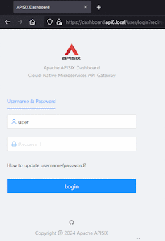
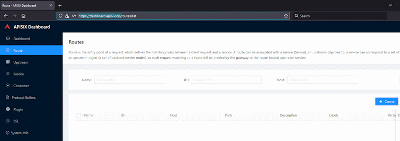
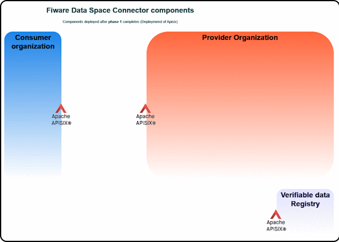

# Apisix
- [Apisix](#apisix)
  - [Step01: _Deploy a basic version of a helloWorld chart_](#step01-deploy-a-basic-version-of-a-helloworld-chart)
  - [Step02: Deploy a functional version of apisix](#step02-deploy-a-functional-version-of-apisix)
  - [Step3: Deploy a new route via the Apisix.yaml file](#step3-deploy-a-new-route-via-the-apisixyaml-file)
  - [Step4: Use Admin API to manage routes](#step4-use-admin-api-to-manage-routes)
  - [Bottom line](#bottom-line)

[Apache APISIX](https://apisix.apache.org/) provides rich traffic management features like extension via plugins, Load Balancing, Dynamic Upstream, Canary Release, Circuit Breaking, Authentication, Observability, etc.


The following steps are focused in the deployment of the Helm Chart apisix to install an instance of this open source Apache API Gateway to help you manage the different components of the Fiware Data space. 

## Step01: _Deploy a basic version of a helloWorld chart_
This steps, using the components at the apisix Chart, deploys a basic version of a helloWorld chart (included inside apisix Helm Chart)
1. Decide the DNS to expose the consumer apisix proxy (Local or global DNS)
   eg. fiwaredsc-consumer.local, fiwaredsc-consumer.ita.es, ...
2. For Local DNS register them at the /etc/hosts (ubuntu) and/or C:\Windows\System32\drivers\etc\hosts (windows)
3. Create the TLS Certificate  
    a) Using Organization official certificates (issued by Certification authority companies such as Let’s encrypt, ZeroSSL, …) For every public TLS/SSL certificate, CAs must verify, at a minimum, the requestors' domain.e.g. Let’s encrypt.  
    b) Generate not trusted certificates just for testing:
    ```shell
    openssl req -x509 -nodes -days 365 -newkey rsa:2048 -keyout Helms/apisix/certs/tls-wildcard.key -out Helms/apisix/certs/tls-wildcard.crt -subj "/CN=*.local"
    ```
4. Create the TLS k8s secret generic based on the previously created certificate. Name it _wildcardlocal-tls_ and ensure the value files refers to this secret at the _utils.echo.ingress.tls.secretName_
  ```shell
  kubectl create secret tls wildcardlocal-tls -n apisix --key Helms/apisix/certs/tls-wildcard.key --cert Helms/apisix/certs/tls-wildcard.crt
  ```
  If the namespace does not exist yet, create it:
  ```shell
  kubectl create ns apisix
  ```
6. Customize the Apisix values file  
For example, you can start enabling just the utils components activating the enabled flags for utils and deactivating it for the Apisix component  
    ```yaml
    utils:
      enabled: true
      echo:
        enabled: true
        ingress: 
          enabled: true
    ...
    apisix:
      enabled: false
    ```
1. Deploy the helm
    ```shell
    hFileCommand apisix install
    # Will execute helm command: helm -n test install -f "./Helms/apisix/values.yaml" apisix "./Helms/apisix/"  --create-namespace
    ```
2. Test it. Does it work?
    ```shell
    curl https://fiwaredsc-consumer.local
    curl -k https://fiwaredsc-consumer.local
    ```

## Step02: Deploy a functional version of apisix  
NOTE to avoid refering to the namespace apisix at each command, the ENV VAR DEF_KTOOLS_NAMESPACE=apisix is set:
```shell
export DEF_KTOOLS_NAMESPACE=apisix
```

1. Modify the values to enable apisix and disable the util's ingress.
2. Deploy the changes
    ```shell
    hFileCommand apisix restart
    # Running CMD=[helm -n apisix install -f "./Helms/apisix/values.yaml" apisix "./Helms/apisix/"  --create-namespace]
    ```
3. After some seconds the deployments should be running
    ```shell
    kGet 
    #   Running command [kubectl get pod  -n apisix  ]
    ---
    NAME                                         READY   STATUS    RESTARTS   AGE
    apisix-control-plane-7ffd9fdc4c-2jpw5        1/1     Running   0          5h23m
    apisix-dashboard-78d68bf7c5-cmb28            1/1     Running   0          5h23m
    apisix-data-plane-8488664577-4t7lg           1/1     Running   0          5h23m
    apisix-etcd-0                                1/1     Running   0          5h23m
    apisix-ingress-controller-5b8f85878d-vpggm   1/1     Running   0          5h23m
    echo-588c888c78-r2d7d                        1/1     Running   0          5h23m
    netutils-65cd7b88b8-fwn5h                    1/1     Running   0          5h23m
    ```
4. Test it. Does it work?
    ```shell
    curl -k https://fiwaredsc-consumer.local
    ```

## Step3: Deploy a new route via the Apisix.yaml file
As you have seen, there is a dashboard component deployed, but just one dns managed by the Apisix ingress. This step will modify the apisix.yaml file to include a new route to expose the dashboard to be consumed via browser.
1. Decide the DNS to expose the Apisi dashboard (Local or global DNS)
eg. fiwaredsc-api6dashboard.local ...
2. For Local DNS register at the /etc/hosts (ubuntu) and/or C:\Windows\System32\drivers\etc\hosts (windows)
3. Modify the values file to use the new dns and the wildcard tls certificate
    ```yaml
    apisix:
      ...
      ingress:
        enabled: true
        hostname: fiwaredsc-consumer.local
        tls: true
        extraHosts:
          - name: fiwaredsc-api6dashboard.local
            path: /
        extraTls:
          - hosts: [fiwaredsc-consumer.local, fiwaredsc-api6dashboard.local]
            secretName: wildcard_local-tls
      ...
    ```
4. Modify the ./Helms/apisix.apisix-routes.yaml to add the route for the Apisi dashboard:
      ```yaml
      routes:
      - 
        uri: /*
        host: fiwaredsc-api6dashboard.local
        methods: 
          - GET    
          - POST
          - PUT
          - HEAD
          - CONNECT
          - OPTIONS
          - PATCH
          - DELETE
        upstream:
          type: roundrobin
          nodes:
            apisix-dashboard:80: 1
      #END
      ```
7. Redeploy the helm chart:
    ```shell
    hFileCommand api upgrade
    # Running CMD=[helm -n apisix upgrade -f "./Helms/apisix/./values.yaml" apisix "./Helms/apisix/./"  --create-namespace]
    Release "apisix" has been upgraded. Happy Helming!
    ```
8. Test it. Does it work?
    ```shell
    curl -k https://fiwaredsc-api6dashboard.local
    ```
    <p style="text-align:center;font-style:italic;font-size: 75%"><br/>
    APISIX Dashboard</p>
9. Retrieve the password to login at a browser.  
If you visit the values file, the secret and the key used to store the dashboard user's password are defined:
    ```yaml
    apisix:
      dashboard:
        ...
        existingSecret: apisix-dashboard-secrets
        existingSecretPasswordKey: apisix-dashboard-secret
        ...
    ```
    So, use kubectl command to retrieve the password:  
    ```shell
    kSecret-show dashboard-secrets -f apisix-dashboard-secret -v
    Running CMD=[kubectl get -n apisix secrets apisix-dashboard-secrets -o jsonpath='{.data.apisix-dashboard-secret}' | base64 -d]
    ```
    <p style="text-align:center;font-style:italic;font-size: 75%"><br/>
    APISIX Routes</p>

    You may notice that none of the routes defined at the apisix.yaml file appear here. This is because the dashboard usually displays routes that were created via the Admin API because it directly interacts with APISIX's etcd storage. When you load configuration from a YAML file, APISIX typically treats it as static configuration, so it doesn’t get recorded in etcd in a way that the dashboard can view.  

## Step4: Use Admin API to manage routes
Instead of modifying the apisix.yaml file, routes can be managed via Admin API (the deployment **Apisix-control-plane** exposes the endpoints to manage them) or via the dashboard set up at the previous Step.  
In this exercise, using one of the provided _manageAPI6Routes.ypynb_ or _manageAPI6Routes.sh_ files, recreate the route /hello using the Admin API. These files are at the [/scripts folder](../../scripts/):
1. If it still exists, delete the /hello route from the apisix.yaml file and redeploy the helm chart
2. Test the /hello route. Does it work? It should not.
    ```shell
    $ curl -k https://fiwaredsc-consumer.local
    {"error_msg":"404 Route Not Found"}
    ```
3. Analyze and execute the _manageAPI6Routes.ypynb_ or _manageAPI6Routes.sh_ files to recreate the route /hello using the Admin API
4. Visit the https://fiwaredsc-api6dashboard.local at the browser to view the /hello route.
   <p style="text-align:center;font-style:italic;font-size: 75%"><br/>
    APISIX Routes</p>
5. Test the /hello route. Does it work? Now, it should.
    ```shell
    $ curl -k https://fiwaredsc-consumer.local/hello
    ```
    But... it does not. This is because the routes managed by the Admin API (The control-plane component) are used when the data-plane's role is set to use the config_provider: etcd.  
6. Modify the data-plane deployment's configuration to change the config_provider:
```yaml
dataPlane:
   ingress:
    ...
    extraConfig:
      # https://apisix.apache.org/docs/apisix/deployment-modes/
      deployment:
        role_data_plane:
        #   # Decoupled
        #   # In the decoupled deployment mode the data_plane and control_plane instances of APISIX are deployed 
        #   # separately, i.e., one instance of APISIX is configured to be a data plane and the other to be a control plane.
          config_provider: etcd
```

7. Test the /hello route. Does it work? Now, it should.
    ```shell
    curl -k https://fiwaredsc-consumer.local/hello
    ```
    Nevertheless, as the routes are now managed by the etcd component, the dashboard is not working. Try    
    ```shell
    curl -k https://fiwaredsc-api6dashboard.local
    {"error_msg":"404 Route Not Found"}
    ```
8. To reenable it, add the route via Admin PAPI modifying the manageAPI6Routes.sh or .ipynb files to POST it.

## Bottom line
Once the apisix helm chart is fully deployed, the Fiware Data Space future architecture deployed looks like:
   <p style="text-align:center;font-style:italic;font-size: 75%"><br/>
    Deployed architecture after phase 1 completed</p>