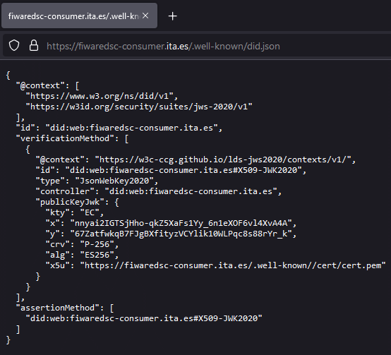
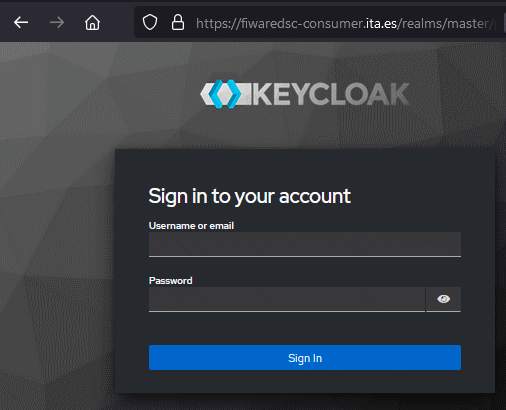
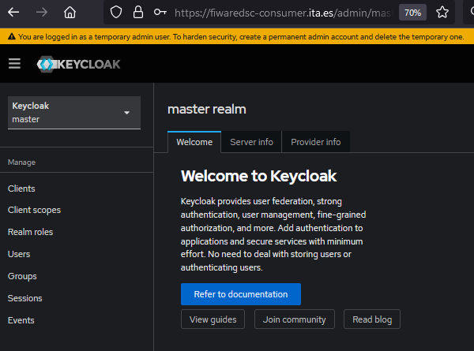
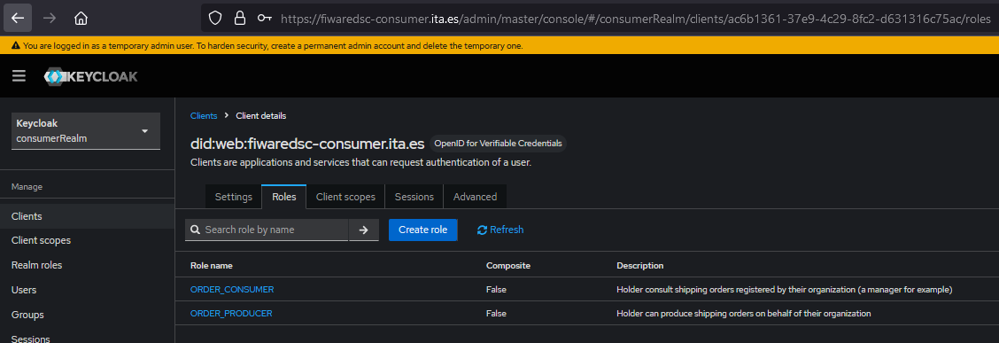

# Consumer's infrastructure
- [Consumer's infrastructure](#consumers-infrastructure)
  - [Decentralized Identifiers](#decentralized-identifiers)
  - [Verifiable Credentials](#verifiable-credentials)
    - [Usage and actors around a VC](#usage-and-actors-around-a-vc)
    - [Benefits of Using DIDs with VCs](#benefits-of-using-dids-with-vcs)
  - [Step3.1: _Deployment of the DID:key_](#step31-deployment-of-the-didkey)
    - [values-did.key.yaml](#values-didkeyyaml)
    - [values-did.web.yaml](#values-didwebyaml)
    - [Verification](#verification)
      - [values.did.key.yaml](#valuesdidkeyyaml)
      - [values.did.web.yaml](#valuesdidwebyaml)
  - [Step3.2-Publication of the did:web route](#step32-publication-of-the-didweb-route)
  - [_Step3.3-Deployment of the Keycloak_](#step33-deployment-of-the-keycloak)
    - [Verification](#verification-1)
  - [Step3.4-Publication and first access to the Keycloak route](#step34-publication-and-first-access-to-the-keycloak-route)

Any participant willing to consume services provided by the data space will require a minimum infrastructure that will enable the management of Verifiable Credentials besides a Decentralized Identifier that will constitue the signing mechanism to authenticate any message, any request made by the consumer.   
This section describes the steps and the components to be deployed.  

## Decentralized Identifiers
**Decentralized Identifiers (DIDs)** are a new type of digital identifier designed to give users control over their own digital identities. Unlike traditional identifiers like email addresses or usernames, DIDs are decentralized and do not rely on a centralized authority for creation or verification.

Each DID includes a method, defining how it’s created and managed. Here’s an overview of the two DID methods used in this deployment, `did:web` and `did:key`:

1. **DID:web**
   - They provide a DID that can be resolved using the traditional Domain Name System (DNS).
   - **Structure**: `did:web:fiwaredsc-consumer.ita.es` where `fiwaredsc-consumer.ita.es` is the domain hosting the DID document.
   - **Usage**: Used to sign any message exchange with the data space, although out of the context of a Data Space, it can also be used to leverage their existing web infrastructure to host and verify DID documents.
   - **Resolution**: The DID document is hosted at a well known URL (e.g. `https://fiwaredsc-consumer.ita.es/.well-known/did.json`)
   
2. **DID:key**
   - They provide a self-contained, cryptographic DID that requires no external hosting.
   - **Structure**: `did:key:z6Mk...`, where the key identifier represents a public key encoded directly in the DID.
   - **Usage**: Suitable for quick, ephemeral identities or offline situations, where persistence or external verification isn’t needed.
   - **Resolution**: The DID itself encodes a public key, which can be used directly to derive a DID document.
   - is self-contained, suitable for temporary or cryptographic identities without external dependencies.

## Verifiable Credentials
**Verifiable Credentials (VCs)** are tamper-evident digital claims that verify information about a person, organization, or asset, and they rely on **Decentralized Identifiers (DIDs)** for issuer and holder identification. Together, VCs and DIDs form a foundational system for decentralized identity and trust on the internet.

### Usage and actors around a VC
In the use of a VC is very well described at this image: 
   <p style="text-align:center;font-style:italic;font-size: 75%"><br/>VC Usage and Actors around them</p>
    
The roles of the actors related with the usage of a VC are:
1. **Issuance**:
   - An **VCIssuer** (in the context of the Data Space is any organization taking part of it, both data consumer and data providers). Its role is to issue VCs. This VC contains a number of claims related with the VC Holder. A Holder can be a Human (Eg. _The Issuer claims that a Person is named Paul and that its role inside the organization is the role of [LEAR](https://eufunds.me/what-is-a-lear-legal-entity-appointed-representative/#:~:text=A%20LEAR%20is%20a%20Legal%20Entity%20Appointed%20Representative.))_
   - The issuer signs the VC using their DID, which proves the authenticity of the credential without depending on a centralized authority. The DID serves as a unique identifier that can be verified against a DID document containing the public keys and verification methods for the issuer.

2. The **holder** of the VC (e.g., an employee of an organization) receives and stores the credential, often in a [digital wallet app](https://ec.europa.eu/digital-building-blocks/sites/display/EUDIGITALIDENTITYWALLET/EU+Digital+Identity+Wallet+Home). This credential is bound to their DID.
   - The holder can present this VC to any third party (a **verifier**) when they need to prove the authenticity of a claim (e.g., that they are the LEAR of an organization).

3. - A **verifier** (e.g., a data provider willing to verify the identity of the requestor of a service) receives the VC from the holder and verifies its authenticity by checking the issuer’s DID and signature.
   - The verifier can confirm both that the issuer is legitimate (by looking up the DID document for the issuer) and that the VC has not been tampered with, thanks to the cryptographic signature.

### Benefits of Using DIDs with VCs

- **Decentralization**: DIDs eliminate the need for a central authority, making identity verification more privacy-respecting and resilient.
- **Control and Privacy**: Holders have control over which VCs to share and with whom, which reduces unnecessary exposure of personal data.
- **Interoperability**: VCs and DIDs are based on open standards, enabling them to work across different systems and applications.


To extend the knowledge of these concepts, the web offers a handful set of resources, some of them:
- [decentralized_IAM by Stefan Wiedemann](https://github.com/wistefan/presentations/blob/main/data-spaces-onboarding/decentralized-trust-and-iam/decentralized_IAM.pdf)
- [Verifiable Credentials: The Ultimate Guide 2024](https://www.dock.io/post/verifiable-credentials)
- ...

In this phase, setups to deploy both did: `did:key` and `did:web` will be shown. but the fact that the use of a did:web implies the control of a public DNS to publicly expose the well known did:web endpoint for being consumer by any 'verifier' and mainly to route cloud requests to the server bound to the did:web DNS.   
_eg. to use the `did:web:fiwaredsc-consumer.ita.es`, The [Instituto Tecnológico de Aragón (ITA)](https://www.ita.es/) owner of the `ita.es` domain, must redirect web requests made to https://fiwaredsc-consumer.ita.es to the server in which the DID is exposed at the well known endpoint `https://fiwaredsc-consumer.ita.es/.well-known/did.json`_

## Step3.1: _Deployment of the DID:key_ 
The consumer Helm Chart provides two value files. One to deploy the DID:key component and another to deploy the DID:web one. To deploy the DID:key run:
At this first step, only the utils and the did are enabled to trace potential problems.
### values-did.key.yaml
```yaml
utils:
  enabled: true
  echo:
    enabled: false

# -- configuration for the did-helper, should only be used for demonstrational deployments, 
# see https://github.com/wistefan/did-helper
did:
  enabled: true
  type: key
  port: 3000
  pfx:
    secretName: did-secret
    secretKeyField: store-pass
  cert:
    country: es
    state: ES-AR
    locality: Zaragoza
    organization: ITA
    commonName: www.ita.es
  ingress:
    enabled: false
    host: fiwaredsc-consumer-did.ita.es
```

### values-did.web.yaml
```yaml
utils:
  enabled: true
  echo:
    enabled: false

# -- configuration for the did-helper, should only be used for demonstrational deployments, 
# see https://hub.docker.com/repository/docker/itainnovaprojects/ita-didweb-generator/general
did:
  enabled: true
  type: web
  port: 3000
  pfx:
    fileName: cert.pfx
    alias: ita.es
    secretName: did-secret
    secretKeyField: store-pass
  serviceType: ClusterIP
  baseURL: https://fiwaredsc-consumer.ita.es
  outputFolder: /cert
  cert:
    country: es
    state: ES-AR
    locality: Zaragoza
    organization: ITA
    commonName: www.ita.es
    organizationunit: it
  ingress:
    enabled: false
    host: fiwaredsc-consumer.ita.es
```
**NOTE**: Pay attention that at this moment, the dns used is not a _.local_ one, but a real DNS managed by the ITA organization as explained before.

To deploy the consumer charts just run:
```shell
hFileCommand consumer -f key
# Running CMD=[helm -n consumer install -f "./Helms/consumer/values-did.key.yaml" consumer "./Helms/consumer/"  --create-namespace]
# or
hFileCommand consumer -f web
# Running CMD=[helm -n consumer install -f "./Helms/consumer/values-did.web.yaml" consumer "./Helms/consumer/"  --create-namespace]
```

### Verification
After the components have been deployed, they can be tested running the following commands:
#### values.did.key.yaml
If this file is used to generate the k8s artifacts:
```shell
# Change the default working namespace:
export DEF_KTOOLS_NAMESPACE=consumer

# Check the value of the DID:
kExec net -- curl http://did:3000/did-material/did.env
    Running command [kubectl exec -it -n consumer utils-nettools-8554c96795-pbx9z  --  curl http://did:3000/did-material/did.env]
    DID=did:key:zDnaeg4A7Qaic1XbFpX98Dqk4TexNpXShMynW6po8Mnksn3s9

# Get the cert.pfx file and analyze it:
kExec utils-nettools -- wget http://did:3000/did-material/cert.pfx
    ...
    HTTP request sent, awaiting response... 200 OK
    Length: 1323 (1.3K)
    Saving to: ‘cert.pfx.2’
    ...

# Retrieve the cert.pfx
NETUTILSPOD=$(kGet utils-nettools -v -o yaml | yq eval '.metadata.name' -)
kubectl -n consumer cp $NETUTILSPOD:cert.pfx cert.pfx

# Next command keytool will ask for a password that can be retrieved from secret did-secret:
kSecret-show did -f store-pass -v -y
# Analyze the certificate
keytool -list -v -keystore cert.pfx -storetype PKCS12
    Enter keystore password:  
    Keystore type: PKCS12
    Keystore provider: SUN

    Your keystore contains 1 entry

    Alias name: didprivatekey
    Creation date: Nov 14, 2024
    Entry type: PrivateKeyEntry
    Certificate chain length: 1
    Certificate[1]:
    Owner: CN=www.ita.es, O=ITA, L=Zaragoza, ST=ES-AR, C=es
    Issuer: CN=www.ita.es, O=ITA, L=Zaragoza, ST=ES-AR, C=es
    ...
# rm cert.pfx
```
This previous verification is highly sensitive, so protect this kind of actions at your production k8s cluster; eg. using _KubeArmorPolicies_.

#### values.did.web.yaml
If this file is used to generate the k8s artifacts, the commands are the same, although the output will differ:
```shell
# Change the default working namespace:
export DEF_KTOOLS_NAMESPACE=consumer

# Check the value of the DID:
kExec net -v -- curl http://did:3000/did-material/did.env
    DID=did:web:fiwaredsc-consumer.ita.es

# Get the cert.pfx file and analyze it:
...
```
This previous verification is highly sensitive, so protect this kind of actions at your production k8s cluster; eg. using _KubeArmorPolicies_.

## Step3.2-Publication of the did:web route
As explained before, one of the requirements of the did:web DIDs is that they must be accessible from the internet at the well known endpoint `/.well-known/did.json`. To setup a new route to access this json document it is mandatory to have the control of the chosen DNS having its certificates (these certificates will have to be signed by an Certification Authority (CA)):
1. Create a tls secret containing the certificate files.
  ```shell
  kubectl create secret tls wildcard-ita.es-tls -n apisix --key /certificates/<organization>/privkey.pem --cert /certificates/<organization>/fullchain.pem
  ```
2. Modify the Apisix to manage a new DNS (`fiwaredsc-consumer.ita.es`) using the tls `wildcard-ita.es-tls` and upgrade the Apisix Helm chart.

3. Once deployed, a new route must be registered to expose the did.json document at the endpoint `https://fiwaredsc-consumer.ita.es/.well-known/did.json`

To test it is working, browse this URL:
<p style="text-align:center;font-style:italic;font-size: 75%"><br/>
    did-web.json exposed at a well known URL</p>

## _Step3.3-Deployment of the Keycloak_
[Keycloak](https://www.keycloak.org/) is an open source identity and access management solution that on its [release v25](https://www.keycloak.org/docs/latest/release_notes/index.html#openid-for-verifiable-credential-issuance-experimental-support) supports the protocol [OpenID for Verifiable Credential Issuance (OID4VCI) OID4VC](https://openid.net/specs/openid-4-verifiable-credential-issuance-1_0.html) to manage Verifiable Credentials, and so, it can play the role of VCIssuer in the data space architecture.  
The values of the Keycloak are more complex than previous helms, so it is recomended to analyze them to get familiar with. As a brief summary, the values focus on the following areas:
- It setups a [postgresSql](https://www.postgresql.org/) instance.
- No ingress is enabled as the Keycloak will be exposed via an apisix route.
- Internally, the pods expose their endpoints via the https ports setting up a tls using the dns `fiwaredsc-consumer.ita.es`, so both inside and outside the k8s network the URL to access the Keycloak will be `https://fiwaredsc-consumer.ita.es/`
- A [Realm](https://mi-do.medium.com/understanding-realms-clients-and-roles-in-keycloak-c88a6e57d74f) `consumerRealm` is created at startup to manage a set of users, credentials, roles, and verifiable credentials

The deployment of the helm is taking in the development server around 3 minutes, so while an error appears or the deployment is successful, it is interesting to check to correct deployment of the chart, you can use the `devopTools` commands `kGet`, `kLog`, `kDescribe`, ... It is also interesting to analyze the k8s components generated using the command `hFileCommand`:
```shell
hFileCommand consumer debug > .tmp/componentsconsumer.yaml
```

NOTE: Most of the secrets used in this tutorial are randomly generated and although they are tried to be kept, they could be deleted. Imagine, _this helm chart is uninstalled and the secret manually deleted_. A new deployment of the chart will generate a new secret with new passwords to access the previously generated DDBB using a previously existing password (that has been destroyed forever). In these scenarios the only options are:
- Recreate the DDBB from scratch
- Stablish a policy to save the secrets and install manually them instead of generate new ones with random passwords.  

### Verification
Once the consumer helm has been deployed, it should look similar to this:
```shell
kGet 
#   Running command [kubectl get pod  -n consumer  ]
NAME                              READY   STATUS    RESTARTS   AGE
consumer-keycloak-0               1/1     Running   0          3m37s
consumer-postgresql-0             1/1     Running   0          3m37s
did-web-7b8f9b5d5d-lwwsf          1/1     Running   0          3m37s
utils-nettools-8554c96795-b6ssf   1/1     Running   0          3m37s
```

By now the endpoint is not externally accessible, but this command to show the well known openid configuration should work (`HTTP/2 200` should be the returned status request.):
```shell
curl -k https://consumer-keycloak/realms/consumerRealm/.well-known/openid-configuration -H fIdsc-consumer-keycloak.ita.es
  HTTP/2 200 
  cache-control: no-cache, must-revalidate, no-transform, no-store
  content-type: application/json;charset=UTF-8
  referrer-policy: no-referrer
  strict-transport-security: max-age=31536000; includeSubDomains
  x-content-type-options: nosniff
  x-frame-options: SAMEORIGIN
  x-xss-protection: 1; mode=block
```

Not to mention that this previous command is faking the Host name, but the whole values file should be tailored to match the DNS managed by your organization to be used.

## Step3.4-Publication and first access to the Keycloak route
In the [_Step3.2-Publication of the did:web route_](#step32-publication-of-the-didweb-route), the tls secret `wildcard-ita.es-tls` and the changes in the `Apisix` gateway to manage the `fiwaredsc-consumer.ita.es` were already done, so at this stage, only the publication of a new route is required to redirect requests to `https://fiwaredsc-consumer.ita.es/` to the newly created Keycloak service:

To test it is working, browse the URL [https://fiwaredsc-consumer.ita.es](https://fiwaredsc-consumer.ita.es):
<p style="text-align:center;font-style:italic;font-size: 75%"><br/>
    Keycloak exposed at the URL https://fiwaredsc-consumer.ita.es</p>

To know the user and the password, again, the values file must be revisited:
```yaml
keycloak:
  extraEnvVars:
    - name: KEYCLOAK_ADMIN
    value: "admin0"
```

To know the password, the k8s components generated can be revisited to discover an env var containing the secret that keeps this password. `KEYCLOAK_ADMIN_PASSWORD`. To get it, instead of analyzing the secret, a simple `echo` will do the trick:
```shell
kExec keycloak -n consumer -v -c keycloak -- printenv KEYCLOAK_ADMIN_PASSWORD
```
Once logged in, the portal will present a message explaining that the `admin0` is a temporary admin user.
<p style="text-align:center;font-style:italic;font-size: 75%"><br/>
    First access to the keycloak portal at the URL https://fiwaredsc-consumer.ita.es</p>

At this point, a new admin user can be created and the different sections of the realm (`consumerRealm`) can be visited. For example this image show the roles defined for the `did:web:fiwaredsc-consumer.ita.es` client at the consumerRealm realm:
<p style="text-align:center;font-style:italic;font-size: 75%"><br/>
    consumerRealm roles for its `did:web:fiwaredsc-consumer.ita.es` client</p>