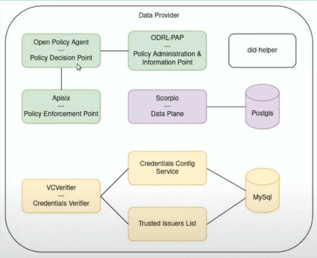
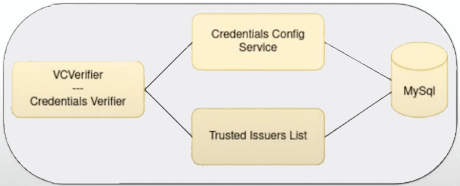
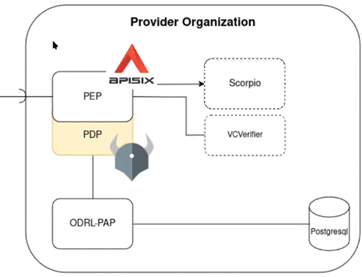
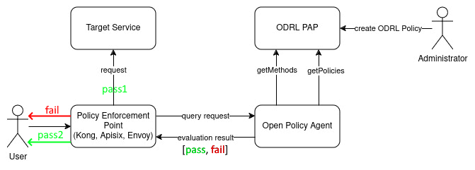
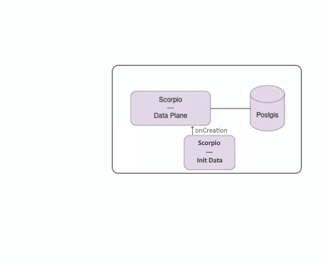
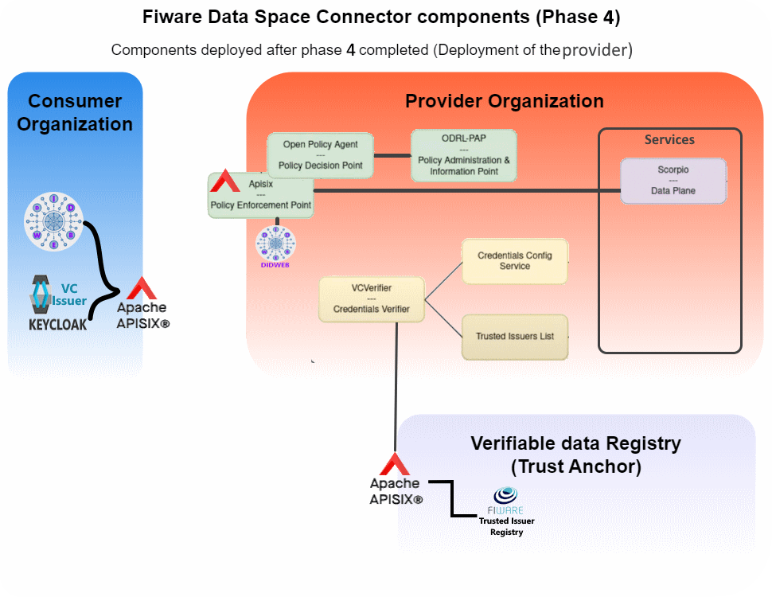

# Provider's infrastructure
- [Provider's infrastructure](#providers-infrastructure)
  - [Step4.1- _Deployment of the common components_](#step41--deployment-of-the-common-components)
  - [Step4.2- _Deployment of the authentication components_](#step42--deployment-of-the-authentication-components)
    - [Verification of the deployment so far](#verification-of-the-deployment-so-far)
  - [Step4.3- _Deployment of the authorization components_](#step43--deployment-of-the-authorization-components)
  - [Step 4.4- _Deployment of the service components_](#step-44--deployment-of-the-service-components)
  - [Step 4.5- Addition of the service route to the Apisix without security](#step-45--addition-of-the-service-route-to-the-apisix-without-security)
  - [Step 4.6- Addition of the service route to the Apisix with VC Authentication](#step-46--addition-of-the-service-route-to-the-apisix-with-vc-authentication)
  - [Bottom line](#bottom-line)

    
The objective of this phase is to deploy the following infrastructure.
<p style="text-align:center;font-style:italic;font-size: 75%"><br/>
    Provider components</p>

Any organization willing to market their data and or services in a dataspace will require such infrastructure to manage:
- **The authentication phase**: Its components are represented by the yellow blocks at the *Provider components diagram*.  
  They analyze that any request made to the provider's services are made by a known and verified participant.
- **The authorization phase**: Its components are represented by the green blocks at the *Provider components diagram*.  
  They analyze that any request made to their services are made by a participant entitled to perform the requested action.
- **The access to the data and or services offered**. These components are represented by the purple blocks at the *Provider components diagram*.  
  This walkthrough shows the deployment of a [Context Data broker Scorpio](https://scorpio.readthedocs.io/en/latest/) to provide NGSI-LD data access.
    
To split the deployment of the provider's components, it has been split into 4 interrelated Helm charts:
- A **_common helm chart_** with the components used by the other charts. e.g. the _did generator_ (white components of the diagram).
- The **_authentication helm chart_** (yellow components of the diagram)
- The **_authorization helm chart_** (green components of the diagram)
- The **_services helm chart_** (purple components of the diagram)
- 
## Step4.1- _Deployment of the common components_
This Helm chart contains the following components:
- A did:web `did:web:fiwaredsc-provider.ita.es` component to provide a decentralized identifier to the provider, used to sign the messages generated at the provider's side. Despite being deployed at this block (_Authentication components_), it is generic and it is going to be used across all the data provider interactions.
- The already seen utilities pods.
```shell
hFileCommand provider/common
    # Running CMD=[helm -n provider install -f "./Helms/provider/common/values.yaml" provider-common "./Helms/provider/common/"  --create-namespace]
kGet -w
    Every 2.0s: kubectl get pod -n provider                                                                                                                            V22088: Tue Nov 19 23:45:58 2024

    NAME                              READY   STATUS    RESTARTS   AGE
    did-web-7789dd6dc7-9zj9b          1/1     Running   0          25s
    utils-echo-6ff8f87546-tx5gw       1/1     Running   0          25s
    utils-nettools-8554c96795-c9j96   1/1     Running   0          25s
```
## Step4.2- _Deployment of the authentication components_
This Helm chart contains the following components:
<p style="text-align:center;font-style:italic;font-size: 75%"><br/>
    Authentication components</p>

- A MySql DB server to provide storage to the _Fiware Trusted Issuer List_ and the _Credential Config Service_ as shown in the diagram.
- [Fiware Trusted Issuers List](https://github.com/FIWARE/trusted-issuers-list), It is the same component than the _Fiware Trusted Issuers List_ deployed at the trustAnchor. It plays the role of providing a [Trusted Issuers List API](https://github.com/FIWARE/trusted-issuers-list/blob/main/api/trusted-issuers-list.yaml) to manage the issuers in the provider.
- A [Credential Config Service](https://github.com/FIWARE/credentials-config-service): This service manages the Trusted issuer registries and the Trusted issuer local registries to be used to permorm the credential authentication. It enables the support the use of multiple trust anchors.
- A [VCVerifier](https://github.com/FIWARE/VCVerifier) that provides the necessary endpoints(see [API](https://github.com/FIWARE/VCVerifier/blob/main/api/api.yaml)) to offer [SIOP-2](https://openid.net/specs/openid-connect-self-issued-v2-1_0.html#name-cross-device-self-issued-op)/[OIDC4VP](https://openid.net/specs/openid-4-verifiable-presentations-1_0.html#request_scope) compliant authentication flows to request and present VC credentials as an extension to the well-established [OpenID Connect](https://openid.net/connect/). It exchanges VerfiableCredentials for JWT, that can be used for authorization and authentication in down-stream components.

```shell
hFileCommand provider/authentication
    # Running CMD=[helm -n provider install -f "./Helms/provider/authentication(verif+credentConfigSvc+til)/values.yaml" provider-authentication "./Helms/provider/authentication(verif+credentConfigSvc+til)/"  --create-namespace]
kGet -w
    Every 2.0s: kubectl get pod -n provider                                                                                                                            V22088: Tue Nov 19 23:48:38 2024

    NAME                              READY   STATUS    RESTARTS      AGE
    cconfig-6f88d6f88f-p9z29          1/1     Running   2 (58s ago)   67s
    did-web-7789dd6dc7-9zj9b          1/1     Running   0             3m5s
    mysql-0                           1/1     Running   0             67s
    til-5bb9996596-24chf              1/1     Running   2 (58s ago)   67s
    utils-echo-6ff8f87546-tx5gw       1/1     Running   0             3m5s
    utils-nettools-8554c96795-c9j96   1/1     Running   0             3m5s
    verifier-64965b55f9-qktrq         1/1     Running   0             67s
```

The VCVerifier's routes endpoints have to be exposed at the apisix to enable the OIDC protocol with clients. 
The endpoint will be `https://fiwaredsc-provider.ita.es/.well-known/openid-configuration` and as the dns is already registered at the Apisix, only the new routes have to be added to the apisix data plane, using the same steps that in previous additions using one of the manageAPI6Routes options (script of jupyterhub).

### Verification of the deployment so far
Besides checking that the pods have been properly deployed, a number of curl requests can be made to verfy the set:
```json
export DEF_KTOOLS_NAMESPACE=provider
kGet
# Checks the trusted issuer list:
kExec net -- curl http://til:8080/v4/issuers/
  {"self":"/v4/issuers/","items":[],"total":0,"pageSize":0,"links":null}

# Checks the credential config service:
kExec net -- curl http://cconfig:8080/service
  {"total":0,"pageNumber":0,"pageSize":0,"services":[]}

# Checks the verifier
kExec net --curl http://verifier:3000/health
  {"status":"OK","component":{"name":"vcverifier","version":"" } }

# Checks the well known OpenID endpoint
kExec net -- curl https://fiwaredsc-provider.ita.es/.well-known/openid-configuration
    {
      "issuer": "http://fiwaredsc-provider.ita.es",
      "authorization_endpoint": "http://fiwaredsc-provider.ita.es",
      "token_endpoint": "http://fiwaredsc-provider.ita.es/services/hackathon-service/token",
      "jwks_uri": "http://fiwaredsc-provider.ita.es/.well-known/jwks",
      "scopes_supported": [
          "default",
          "operator"
      ],
      "response_types_supported": [
          "token"
      ],
      "response_mode_supported": [
          "direct_post"
      ],
      "grant_types_supported": [
          "authorization_code",
          "vp_token"
      ],
      "subject_types_supported": [
          "public"
      ],
      "id_token_signing_alg_values_supported": [
          "EdDSA",
          "ES256"
      ]
    }
```
    
## Step4.3- _Deployment of the authorization components_
This Helm chart will deploy the following components:
<p style="text-align:center;font-style:italic;font-size: 75%"><br/>
    Authorization components</p>

  - The _**PEP (Policy Enforcement Point)**_ has two main tasks.  
    - First, it is the entry point for enforcement, meaning it is the point where data or metadata is stopped and transferred to the PDP, the PDP makes a decision and returns it to the PEP.  
    - Secondly, the PEP will subsequently manipulate or lock the data according to the decision.  
  
    This role is played by the [Apache APISIX](https://apisix.apache.org/). This component has been already deployed in previous phases, but at this stage, it is setup to enable its role as PEP for the routes bound to the access to the provider's data or services to enable the interactions shown in the _Provider authorization components and interactions_ diagram.  

  - A **PDP (Policy Decision Point)**: Entity responsible for evaluating access requests and determining whether to permit or deny them based on predefined policies.  
  This role is played by the [**Styra OPA (Open Policy Agent**)](https://www.openpolicyagent.org/) is an open source, general-purpose policy engine that unifies policy enforcement across the stack. OPA provides a high-level declarative language that lets you specify policy as code and simple APIs to offload policy decision-making from your software.


  - The [**ODRL-PAP**](https://github.com/wistefan/odrl-pap) is used to configure policies written in [ODRL](https://www.w3.org/TR/odrl-model/) language to be consumed by the Open Policy Agent(OPA). Therefore it translates the ODRL policies into [Rego language](https://www.openpolicyagent.org/docs/latest/policy-language/). These policies will be later used to check if the incoming requests are authorized. 
  - A **PostgreSql DB server** to support the storage of the ODRL policies.  
    

    <p style="text-align:center;font-style:italic;font-size: 75%"><br/>
      Provider authorization components and interactions</p>

The diagram shows the interactions on this block. In it, the _Administrator_ is responsible of creating the ODRL policies that are used by the OPA when required.  
On the other side, requests to access the provider's data or services made by the _user_ are forwarded to the OPA to evaluate if they are authorized based on the ODRL policies.  
Finally, the request is forwarded to the requested endpoint or rejected.


```shell
hFileCommand provider/authorization
    # Running CMD=[helm -n provider install -f "./Helms/provider/authorization(odrlpap+opa)/./values.yaml" provider-authorization "./Helms/provider/authorization(odrlpap+opa)/./"  --create-namespace]
kGet -n provider
    #   Running command [kubectl get pod  -n provider  ]
    # Showing pod in namespace [provider]
    NAME                              READY   STATUS    RESTARTS      AGE
    cconfig-6f88d6f88f-fd65f          1/1     Running   2 (10h ago)   10h
    did-web-7789dd6dc7-8h477          1/1     Running   0             10h
    mysql-0                           1/1     Running   0             10h
    odrl-pap-588c44bc47-nsw47         1/1     Running   0             11h
    postgresql-0                      1/1     Running   0             11h
    til-5bb9996596-h5wq8              1/1     Running   2 (10h ago)   10h
    verifier-64965b55f9-w4762         1/1     Running   0             10h
```

## Step 4.4- _Deployment of the service components_
This Helm chart will deploy the following components:

<p style="text-align:center;font-style:italic;font-size: 75%"><br/>
    Service components (Will vary depending on the offered services)</p>

- **Target Service**: This walkthrough will deploy a [Context Data broker Scorpio](https://scorpio.readthedocs.io/en/latest/) to provide NGSI-LD data access. The DNS `fiwaredsc-provider.ita.es` will route requests to this service.  
- A **Postgis DB server** to support the storage of the NGSI-LD records. Postgis is used by the Scorpio Context Broker as it can manage spatial data.
- A **Job to initialize data**: In this scenario, it just inserts some data into de Scorpio CB
  
```shell
hFileCommand provider/service
    # Running CMD=[helm -n service install -f "./Helms/provider/services(dataplane)/values.yaml" services "./Helms/provider/services(dataplane)/"  --create-namespace]
kGet -n service
    #   Running command [kubectl get pod  -n service  ]
    # Showing pod in namespace [service]
    NAME                          READY   STATUS      RESTARTS   AGE
    ds-scorpio-57889c6cc8-95ht7   1/1     Running     0          23m
    ds-scorpio-init-data-42kqk    0/1     Completed   0          21m
    postgis-0                     1/1     Running     0          23m
```

## Step 4.5- Addition of the service route to the Apisix without security
1. Initially, we are going to modify the apisix values file to enable its management of the new route `fiwaredsc-provider.ita.es` and _upgrade_ the apisix helm chart to just renew the involved components (_apisix-control-plane_)
    ```shell
    hFileCommand api upgrade
      # Running CMD=[helm -n apisix upgrade -f "./Helms/apisix/values.yaml" apisix "./Helms/apisix/"  --create-namespace]
    ```
2. Add a new route to the service
   **NOTE**: This configuration exposes the service without any authentication nor authorization process. It is just created just for testing and should be replaced as soon as possible by the route managed by the Data Space Connector.  
   We are going to redirect the requests to https://fiwaredsc-consumer.ita.es/ngsi-ld/* to the scorpio context broker
    ```json
    # https://fiwaredsc-provider.ita.es/ngsi-ld/...
    ROUTE_PROVIDER_SERVICE_fiwaredsc_providerWithoutAutho_ita_es='{
      "uri": "/ngsi-ld/*",
      "name": "service",
      "host": "fiwaredsc-provider.ita.es",
      "methods": ["GET", "POST", "PUT", "HEAD", "CONNECT", "OPTIONS", "PATCH", "DELETE"],
      "upstream": {
        "type": "roundrobin",
        "scheme": "http",
        "nodes": {
          "ds-scorpio.service.svc.cluster.local:9090": 1
        }
      },
      "plugins": {
        "proxy-rewrite": {
            "regex_uri": ["^/ngsi-ld/(.*)", "/ngsi-ld/$1"]
        }
      }
    }'
    ```

    ```shell
    # Test the service
    curl https://fiwaredsc-provider.ita.es/ngsi-ld/v1/entities?type=Order
        [ {
          "id" : "urn:ngsi-ld:Order:SDBrokerId-Spain.2411331.000003",
          "type" : "Order",
          "dateCreated" : {
            "type" : "Property",
        ...
    ```
    **NOTE**: The order record shown has been inserted by the job created to initialize the data.

## Step 4.6- Addition of the service route to the Apisix with VC Authentication    
  To enable the apisix to play the PEP role, this step is adding a plugin to the NGSI-LD service `fiwaredsc-provider.ita.es/ngsi-ld/` route. The plugin will play the PEP (Policy Enforcment Point) role.  
     The `ROUTE_PROVIDER_SERVICE_fiwaredsc_provider_ita_es` json contains a new plugins `openid-connect`, an authentication protocol based on the OAuth 2.0 that redirects NGSI-LD requests to the VCVerifier, as it implements the [OIDC4VP](https://openid.net/specs/openid-4-verifiable-presentations-1_0.html#request_scope), it will validate the authenticity of the VC presented. Actually, the VC has to be sent by the client embedded inside a VP ([Verifiable Presentation](https://wiki.iota.org/identity.rs/explanations/verifiable-presentations/)).

```json
      # https://fiwaredsc-provider.ita.es/ngsi-ld/...
      ROUTE_PROVIDER_SERVICE_fiwaredsc_provider_ita_es='{
        "uri": "/ngsi-ld/*",
        "name": "service",
        "host": "fiwaredsc-provider.ita.es",
        "methods": ["GET", "POST", "PUT", "HEAD", "CONNECT", "OPTIONS", "PATCH", "DELETE"],
        "upstream": {
          "type": "roundrobin",
          "scheme": "http",
          "nodes": {
            "ds-scorpio.service.svc.cluster.local:9090": 1
          }
        },
        "plugins": {
          "proxy-rewrite": {
              "regex_uri": ["^/ngsi-ld/(.*)", "/ngsi-ld/$1"]
          },
          "openid-connect": {
            # https://apisix.apache.org/docs/apisix/plugins/openid-connect/
            "bearer_only": true
            "use_jwks": true
            "client_id": "hackathon-service"
            "client_secret": "unused"
            "ssl_verify": "false"
            "discovery": "http://verifier.provider.svc.cluster.local:3000/services/hackathon-service/.well-known/openid-configuration"    
          }
        }
      }'
```
    
  As the route already exists, it can be updated (you require its internal id) instead of just created as in the previous routes.  
  Review the manageAPI6Routes script or jupyter files to see how to retrieve it.
  Once retrieved, using the new ENV VAR `ROUTE_PROVIDER_SERVICE_fiwaredsc_provider_ita_es` run the command:

    ```shell
    # Update the route
    ...
    ROUTE_ID=00000000000000000269
    curl -i -X PUT -k https://$IP_APISIXCONTROL:9180/apisix/admin/routes/$ROUTE_ID \
        -H "X-API-KEY:$ADMINTOKEN" \
        -d "$ROUTE_PROVIDER_SERVICE_fiwaredsc_provider_ita_es"
    ...
    ```
  Again, the same request made to get NGSI-LD data will show a `401 Authorization Required` error
  ```shell
    # Test the service
    curl https://fiwaredsc-provider.ita.es/ngsi-ld/v1/entities?type=Order
        <html>
        <head><title>401 Aufthorization Required</title></head>
        <body>
        <center><h1>401 Authorization Required</h1></center>
        <hr><center>openresty</center>
        <p><em>Powered by <a href="https://apisix.apache.org/">APISIX</a>.</em></p></body>
        </html>
  ```

  Requests to access the service will require from now on the possession of a valid JWT token.
  The OIDC conversation will require the proper VC to grant access to the service, VC that has to be embedded inside a ([Verifiable Presentation](https://wiki.iota.org/identity.rs/explanations/verifiable-presentations/)).  
  The OIDC conversation begins at the well known url of the service to be accessed (`https://fiwaredsc-provider.ita.es/.well-known/openid-configuration`). From there, the OIDC-Token endpoint is retrieved (`https://fiwaredsc-provider.ita.es/services/hackathon-service/token`) and the interaction following the rules set for the **_grant_type=vp_token_** to obtain an access token.
  
  The VC to be used is the one generated previously at the section [Issuance of  VCs through a M2M flow (Using API Rest calls)](README-consumer.md#issue-vcs-through-a-m2m-flow-using-api-rest-calls)

  The script [generateAccessTokenFromVC](../../scripts/generateVPToken.sh) will perform this conversation like in the following demo:

  ```shell
  scripts/generateAccessTokenFromVC.sh $VERIFIABLE_CREDENTIAL 
      INFO: EXECUTING SCRIPT [scripts/generateAccessTokenFromVC.sh]:
      VERBOSE=[true]
      TEST=[false]
      PAUSE=[false]
      VERIFIABLE_CREDENTIAL=eyJhbGciOi..WU8xuBWLXA
      OIDC_URL=https://fiwaredsc-provider.ita.es
      CERT_FOLDER=./.tmp/VPCerts
      PRIVATEKEY_FILE=private-key.pem
      PUBLICKEY_FILE=public-key.pem
      STOREPASSWORD_LENGTH=128
      ACCESSTOKEN_SCOPE=operator
      ---
      Generating Certificates to sign the Verifiable Presentation
      - Certificates to sign the DID generated at './.tmp/VPCerts' folder.
      - DID [did:key:zDnaeSz6xXkTik1dZ2Cw92UjGtMAc84knWJK4ioj1J9u8h5Uq] to sign the Verifiable Presentation generated
      ---
      - Generate a VerifiablePresentation, containing the Verifiable Credential:
              1- Setup the header:
      Header: eyJhb...
      ---
              2- Setup the payload:
      Payload: eyJpc3MiOiAiZGlk...
              3- Create the signature:
      Signature: MEUCIBdt...
              4- Combine them to generate the JWT:
      VP_JWT: eyJhbGciOiJFUz...
              5- The VP_JWT representation of the VP_JWT has to be Base64-encoded(no padding!) (This is not a JWT):
      VP_TOKEN=ZXlKaGJHY2lPaUpG...5hffIpsqqYAB8
      ---
      - Finally An access token is returned to be used to request the service (This is a JWT)
      export DATA_SERVICE_ACCESS_TOKEN=eyJhbGciOiJS...rc-L-_w
  ```


## Bottom line
The deployment of the provider components and the coordination with the other blocks leaves the data space ready to be setup and used:

   <p style="text-align:center;font-style:italic;font-size: 75%"><br/>
    Architecture after the provider components deployment is completed</p>