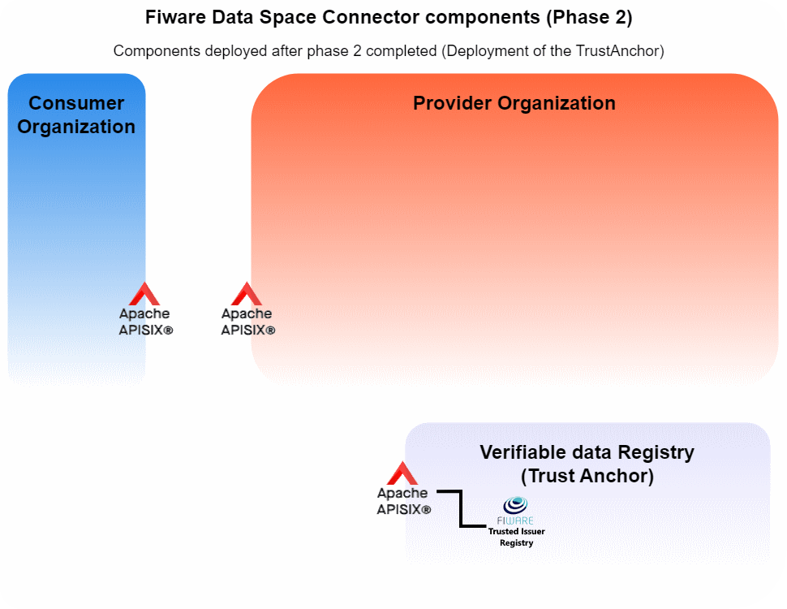

# Verifiable Data Registry
- [Verifiable Data Registry](#verifiable-data-registry)
  - [Step10: _Deploy the Helm trustAnchor helm chart_](#step10-deploy-the-helm-trustanchor-helm-chart)
  - [Bottom line](#bottom-line)

This registry has the responsibility of verifying the validity of the Verifiable Credentials used at any of the data space communications.  
It does not depend on any particular provider nor consumer and there could be even different registries to validate different communications.  
At the scope of this deployment, only one Verifiable data registry will be deployed.  
The main component to be deployed is the [Fiware Trusted Issuers List](https://github.com/FIWARE/trusted-issuers-list), a service that provides an [EBSI Trusted Issuers Registry](https://hub.ebsi.eu/#/) implementation to act as the Trusted-List-Service in the DSBA Trust and IAM Framework. In addition, a [Trusted Issuers List API](https://github.com/FIWARE/trusted-issuers-list/blob/main/api/trusted-issuers-list.yaml) to manage the issuers is provided.

## Step10: _Deploy the Helm trustAnchor helm chart_
1. Deployment of the trustAnchor Helm chart.
    ```shell
    hFileCommand trustAnchor
    # Running command=[helm -n trust-anchor install -f "./Helms/trustAnchor/values.yaml" trust-anchor "./Helms/trustAnchor/"  --create-namespace]
    ...
    ```

    After a few seconds both the mySql server and the Trusted Issuer Registry will be deployed.  
2. Verify it is properly created.
    ```shell
    kGet 
    #   Running command [kubectl get pod  -n trust-anchor  ]
    ---
    NAME                        READY   STATUS    RESTARTS      AGE
    netutils-65cd7b88b8-jw9pp   1/1     Running   0             2m
    tir-7cd5bc7554-d5nsp        1/1     Running   2 (1m ago)    2m
    trust-anchor-mysql-0        1/1     Running   0             2m
    ```
    We see that all pods have Running status and 1/1 instance is ready.

3. Verify it is accessible.
      ```shell
      # Change the default namespace to be used:
      export DEF_KTOOLS_NAMESPACE=trust-anchor

      # Identify the names of the services
      kGet svc
      #   Running command [kubectl get svc  -n trust-anchor  ]
      ---
      NAME                          TYPE        CLUSTER-IP       EXTERNAL-IP   PORT(S)    AGE
      netutils                      ClusterIP   10.96.159.233    <none>        8080/TCP   9m15s
      tir                           ClusterIP   10.107.213.192   <none>        8080/TCP   9m15s
      trust-anchor-mysql            ClusterIP   10.110.106.23    <none>        3306/TCP   9m15s
      trust-anchor-mysql-headless   ClusterIP   None             <none>        3306/TCP   9m15s
      ```
      We see that the service (svc) tir is exposed at port 8080.
      
      ```shell     
      # Access one of the pods with curl installed:
      kExec utils -- curl http://tir:8080/v4/issuers
      # Running command [kubectl exec -it -n trust-anchor netutils-65cd7b88b8-jw9pp  --  curl http://tir:8080/v4/issuers]
      ---
      {"self":"/v4/issuers/","items":[],"total":0,"pageSize":0,"links":null}
      
      kExec utils -- curl -I http://tir:8080/v4/issuers
      # Running command [kubectl exec -it -n trust-anchor netutils-65cd7b88b8-jw9pp  --  curl -I http://tir:8080/v4/issuers]
      ---
      HTTP/1.1 200 OK
      date: Tue, 12 Nov 2024 16:31:45 GMT
      connection: keep-alive
      transfer-encoding: chunked
      ```

      These previous commands show that the service is available.
4. Identify the pieces to create a new apisix route.
   - Decide a DNS to expose the Trusted Issuer Registry. eg. _fiwaredsc-trustanchor.local_ 
   - Decide the methods to be exposed at the route (the lesser, the better)
   - Identify the service to be connected to the route. In the apisix section, all the services exposed, belonged to the same k8s namespace, but from now on, all the services are exposed at different namespaces and hence, the  naming of a service for being globally accessible across the kubernetes cluster is **SVCNAME.NAMESPACE.svc.cluster.local**.  To double check the naming, the _nslookup_ method could be used from inside a pod of the namespace trust-anchor
    ```shell
    kExec utils -- nslookup tir
    # Running command [kubectl exec -it -n trust-anchor netutils-65cd7b88b8-jw9pp  --  nslookup tir]
    ---
    Server:         10.96.0.10
    Address:        10.96.0.10#53

    Name:   tir.trust-anchor.svc.cluster.local
    Address: 10.107.213.192
    ```

    So, the network name of the tir service is **tir.trust-anchor.svc.cluster.local**


5. As a new DNS is in use, the apisix values file has to include it. Modify it, delete the apisix-data-plane deployment and upgrade the helm chart.
    ```shell
    kRemoveRestart deploy data-plane -n api
    # Running command [kubectl delete -n apisix deploy apisix-data-plane]
    hFileCommand api u
    # Running CMD=[helm -n apisix upgrade -f "./Helms/apisix/values.yaml" apisix "./Helms/apisix/"  --create-namespace]
    ```

7. Add a new route to the apisix to expose the Trusted Issuer Registry. Using the tools shown in the previous chapter, add a new route that describes the tir service, for example, using the _manageAPI6Routes.sh_:
    ```json
    ROUTE_TIR_JSON='{
      "name": "TIR",
      "uri": "/*",
      "host": "fiwaredsc-trustanchor.local",
      "methods": ["GET" ],
      "upstream": {
        "type": "roundrobin",
        "nodes": {
          "tir.trust-anchor.svc.cluster.local:8080": 1
        }
      }
    }'
    ```
  
    To test it is accessible try:
    ```shell
    curl -k https://fiwaredsc-trustanchor.local/v4/issuers
    {"self":"/v4/issuers/","items":[],"total":0,"pageSize":0,"links":null}
    ```

## Bottom line
The Trust Anchor deployment has set the corner stone of the data space. Now, the Fiware Data Space architecture deployed looks like:
   <p style="text-align:center;font-style:italic;font-size: 75%"><br/>
    Deployed architecture after phase 2 completed</p>